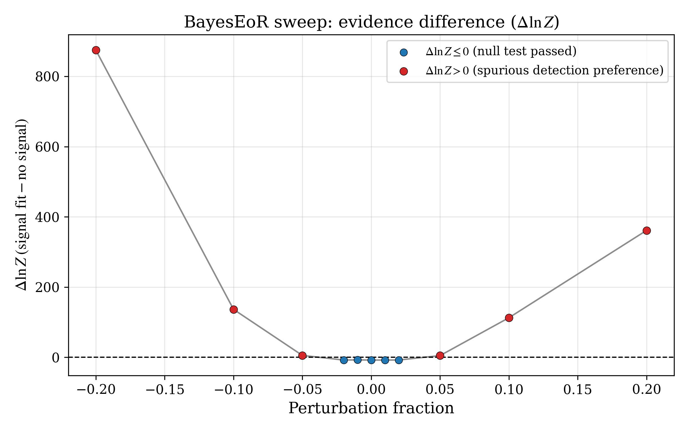
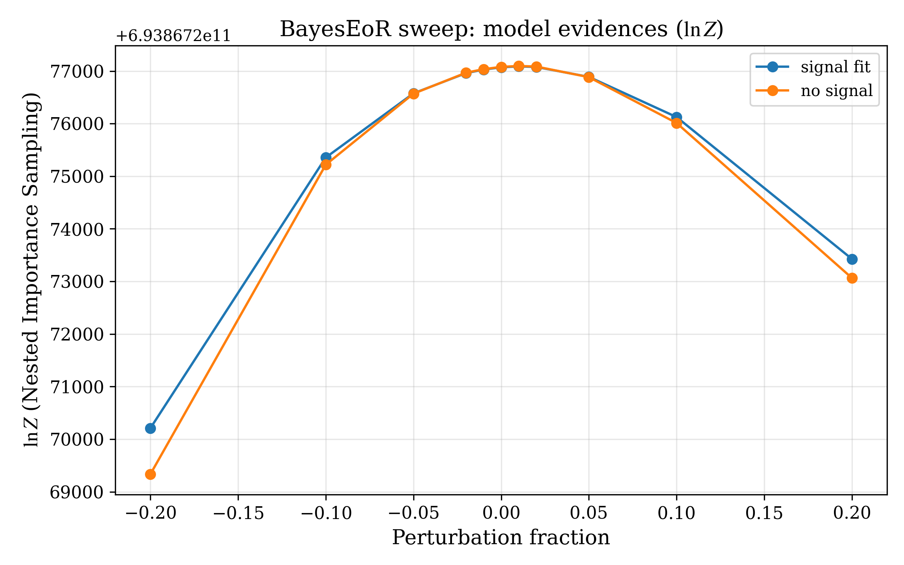
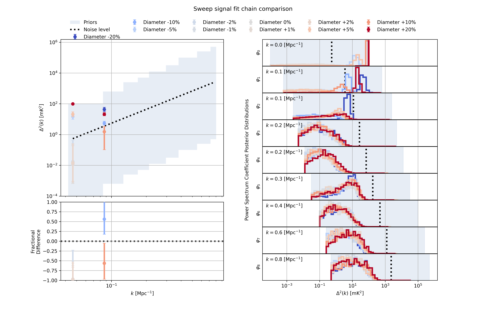

# UKSRC Airy Beam BayesEoR Validation Report: airy_diam14m / GSM_plus_GLEAM / sweep_airy_init

## Report Metadata

| Field | Value |
| --- | --- |
| Report title | UKSRC Airy beam BayesEoR validation report for `airy_diam14m` with `GSM_plus_GLEAM` |
| Campaign identifier | `sweep_airy_init` |
| Beam model | `airy_diam14m` |
| Sky model | `GSM_plus_GLEAM` |
| Validation target | Determine where the BayesEoR null test passes across the tested `antenna_diameter` sweep and use that pass window to set a provisional instrument-modelling accuracy specification |
| Report owner | UKSRC Science Enabling - Science Validation Tooling; P. Sims |
| Report date | 2026-04-25 |
| ValSKA branch or commit | `validation-report-drafts` @ `b529253` |
| External tool versions | Python 3.12.12; `bayeseor` 1.1.1.dev126+g00f53dd3a; `valska` 0.1.1.dev203+g8cd3cd12e.d20260410; `valska-hera-beam-fwhm` 0.1.1.dev135+gc9cdc4cb3.d20260301 |
| Report status | `draft` |

## Executive Summary

This report assesses the UKSRC Airy beam BayesEoR validation sweep `sweep_airy_init`, which perturbs `antenna_diameter` for the `airy_diam14m` beam with the `GSM_plus_GLEAM` sky model. The purpose of the campaign is to determine where the validation null test passes and to use that pass region to inform an instrument-modelling accuracy specification. All 11 sweep points completed successfully according to `sweep_report_summary.json`, and all 11 signal-fit versus no-signal pairings were processed successfully according to `complete_analysis_results.json`.

Draft interpretation: the current sweep identifies a provisional pass window and a failure region. The null test passes at all sampled perturbations from -2 per cent to +2 per cent and fails at all sampled perturbations with magnitude 5 per cent or larger. This suggests that a plus or minus 2 per cent specification is sufficient for the null test to pass in this campaign. A slightly more relaxed tolerance between 2 per cent and 5 per cent may be possible, but it would require additional testing to establish.

Inputs, reproducibility commands, campaign completeness, and assumptions are recorded in [Appendices A-D](#appendix-a-inputs).

## Scope

The campaign tests how sensitive the BayesEoR null-test outcome is to perturbations in the Airy beam antenna diameter. The scientific objective is to identify the perturbation range over which the `airy_diam14m` beam configuration remains consistent with the no-signal hypothesis when analysing the `GSM_plus_GLEAM` mock visibility data recorded in the sweep manifest, and then to use that pass range to inform an instrument-modelling accuracy specification.

The component under test is the BayesEoR evidence response to the beam-model perturbation parameter `antenna_diameter`. The sweep samples 11 perturbations from -20 per cent to +20 per cent, with finer spacing around the nominal model.

The decision enabled by this report is whether the current evidence is sufficient to define a provisional antenna-diameter accuracy specification directly, or whether finer sampling is needed to resolve the transition between the largest tested pass point and the first tested fail point.

## Evidence Diagnostics





*Figures 1 and 2. Top panel: delta log evidence versus perturbation fraction. Bottom panel: signal-fit and no-signal log evidences versus perturbation fraction. These two views present the same underlying Bayesian evidence data. Together they show that the null test passes for all sampled perturbations from -2 per cent to +2 per cent and fails for all sampled perturbations with magnitude 5 per cent or larger, which supports a plus or minus 2 per cent specification as sufficient for the null test to pass in this campaign.*

The trend is not perfectly symmetric: the negative extreme at -20 per cent is more severe than the positive extreme at +20 per cent, but both tails show the same qualitative behaviour. This leaves open the possibility that a slightly more relaxed tolerance between 2 per cent and 5 per cent may also pass, which would require additional testing to establish. A smooth fit to the `Delta ln Z` curve may also be worth exploring in future work as a way to estimate the boundary between sampled points.

## Complete-Analysis Summary

The generated complete-analysis outputs report 11 successful signal-fit versus no-signal comparisons, with 5 PASS classifications and 6 FAIL classifications. Table 1 summarises the key values from [complete_analysis_successful.csv](uksrc_airy_diam14m_gsm_plus_gleam_sweep_airy_init_assets/complete_analysis_successful.csv). The machine-readable results are available in [complete_analysis_results.json](uksrc_airy_diam14m_gsm_plus_gleam_sweep_airy_init_assets/complete_analysis_results.json).

| Perturbation fraction | `Delta ln Z` | Validation |
| --- | ---: | --- |
| -0.20 | 874.77 | FAIL |
| -0.10 | 136.62 | FAIL |
| -0.05 | 5.55 | FAIL |
| -0.02 | -7.63 | PASS |
| -0.01 | -7.24 | PASS |
| 0.00 | -7.74 | PASS |
| +0.01 | -7.72 | PASS |
| +0.02 | -7.55 | PASS |
| +0.05 | 4.98 | FAIL |
| +0.10 | 112.73 | FAIL |
| +0.20 | 361.48 | FAIL |

*Table 1. Compact summary of complete-analysis results for the antenna-diameter sweep. The full generated table is available in [complete_analysis_successful.csv](uksrc_airy_diam14m_gsm_plus_gleam_sweep_airy_init_assets/complete_analysis_successful.csv).*

Taken at face value, these results identify a null-consistent region centred on the nominal beam diameter. For specification setting, the directly supported statement is that a plus or minus 2 per cent specification is sufficient for the null test to pass. A more relaxed tolerance between 2 per cent and 5 per cent may be possible and would require additional testing to establish.

## Power-Spectrum and Posterior Diagnostics



*Figure 3. ValSKA-rendered signal-fit power-spectrum and posterior comparison. This is the primary figure for the report. It supports the interpretation that perturbation-dependent changes are most visible in the lowest-k bins, while the higher-k posterior distributions overlap more substantially across the sweep. The figure is therefore most useful as qualitative support for where the pass and fail regions begin to separate, not as a standalone specification threshold.*

Draft interpretation from visual inspection: the lowest-k power-spectrum points and posterior panels show the clearest separation between the large-perturbation cases and the near-nominal cases. In contrast, several higher-k posterior distributions overlap broadly, which argues for caution when translating this figure into stronger scientific claims.

The current figure is best used as a qualitative diagnostic. It suggests that the perturbation response is concentrated in the lowest-k region, but it does not on its own establish a per-k Bayesian preference. The legacy BayesEoR-delegated figure is retained in the artefact register for comparison but is not reproduced here because it does not add material information beyond Figure 3.

## Limitations

Limitations relevant to the interpretation are summarised in [Appendix G](#appendix-g-limitations).

## Conclusions

- **Conclusion:** Draft interpretation: the current sweep identifies a provisional pass window and a failure region. All 11 sweep points completed successfully. The null test passes at every tested point from -2 per cent to +2 per cent and fails at every tested point with magnitude 5 per cent or larger. On that basis, a plus or minus 2 per cent specification is sufficient for the null test to pass in this campaign.
- **Evidence basis:** [sweep_report_summary.csv](uksrc_airy_diam14m_gsm_plus_gleam_sweep_airy_init_assets/sweep_report_summary.csv), [sweep_report_summary.json](uksrc_airy_diam14m_gsm_plus_gleam_sweep_airy_init_assets/sweep_report_summary.json), [complete_analysis_successful.csv](uksrc_airy_diam14m_gsm_plus_gleam_sweep_airy_init_assets/complete_analysis_successful.csv), and [complete_analysis_results.json](uksrc_airy_diam14m_gsm_plus_gleam_sweep_airy_init_assets/complete_analysis_results.json) all support the same 5 PASS / 6 FAIL split, while Figures 1 and 2 show the same behaviour visually.
- **Residual risk:** A slightly more relaxed tolerance between 2 per cent and 5 per cent may be possible, but it is not established by the sampled points.
- **Recommended action:** Record a plus or minus 2 per cent specification as sufficient for the null test to pass in this campaign, and use finer sampling or a smooth fit to the `Delta ln Z` curve in future work if a less conservative threshold is needed.

## Appendix A: Inputs

| Input | Location or identifier | Notes |
| --- | --- | --- |
| Sweep directory | `validation_results/UKSRC/bayeseor/airy_diam14m/GSM_plus_GLEAM/_sweeps/sweep_airy_init` | Campaign root recorded in `sweep_manifest.json` |
| Report directory | `validation_results/UKSRC/bayeseor/airy_diam14m/GSM_plus_GLEAM/_sweeps/sweep_airy_init/report` | Contains all generated artefacts used in this report |
| Sweep manifest | `validation_results/UKSRC/bayeseor/airy_diam14m/GSM_plus_GLEAM/_sweeps/sweep_airy_init/sweep_manifest.json` | Records 11 `antenna_diameter` points and creation time `2026-02-27T23:36:40Z` |
| BayesEoR template YAML | `src/valska_hera_beam/external_tools/bayeseor/templates/validation_airy_diam14m.yaml` | Referenced directly by the sweep manifest |
| Data product | `/shared/UKSRC-ST/ps550/BayesEoR/UKSRC_val_mock_vis/initial_data_set_from_Quentin/pyuvsims_airy_10022026/vis/diam14m/gsm_plus_gleam-158.30-167.10-MHz-nf-38-fov-19.4deg-circ-field-1-airy_quentin.uvh5` | Input visibility dataset recorded in the sweep manifest |
| Perturbation parameter | `antenna_diameter` | Sampled at 11 fractions from -0.20 to +0.20 |

## Appendix B: Reproducibility Commands

The exact report-generation command for this campaign is:

```bash
python -m valska_hera_beam.external_tools.bayeseor.cli_report \
  validation_results/UKSRC/bayeseor/airy_diam14m/GSM_plus_GLEAM/_sweeps/sweep_airy_init \
  --include-plot-analysis-results \
  --print-complete-analysis-table
```

If the ValSKA environment is already loaded, the equivalent CLI command is:

```bash
valska-bayeseor-report \
  validation_results/UKSRC/bayeseor/airy_diam14m/GSM_plus_GLEAM/_sweeps/sweep_airy_init \
  --include-plot-analysis-results \
  --print-complete-analysis-table
```

For this draft, the equivalent `valska-bayeseor-report` command was observed to exit successfully in the current workspace.

## Appendix C: Campaign Completeness

All 11 sweep points are reported as `ok` in `sweep_report_summary.csv`, and `complete_analysis_results.json` reports 11 successful pointwise comparisons with zero errors. Report-local copies of these generated artefacts are stored under `uksrc_airy_diam14m_gsm_plus_gleam_sweep_airy_init_assets/` so the documentation build can embed the associated figures directly.

| Quantity | Value |
| --- | --- |
| Total sweep points | 11 |
| Complete sweep points | 11 |
| Incomplete sweep points | 0 |
| Evidence source used for sweep interpretation | `ins` for all 11 points |
| PASS points | 5 |
| FAIL points | 6 |
| Error points | 0 |
| Notes | The sweep is complete, so the interpretation is not being driven by missing points; however, the sign change at plus or minus 5 per cent warrants follow-up |

Report-local copies of the completeness summaries are available at [sweep_report_summary.csv](uksrc_airy_diam14m_gsm_plus_gleam_sweep_airy_init_assets/sweep_report_summary.csv) and [sweep_report_summary.json](uksrc_airy_diam14m_gsm_plus_gleam_sweep_airy_init_assets/sweep_report_summary.json). The source generated files remain in the sweep report directory listed in Appendix A.

## Appendix D: Assumptions

| Assumption | Why it matters | Status |
| --- | --- | --- |
| Signal-fit and no-signal chains are paired correctly for each perturbation label | The PASS and FAIL summary is only meaningful if each comparison matches like with like | `tested` via 11 successful pairings in `complete_analysis_results.json` |
| The `ins` evidence source is the intended source for sweep-level interpretation | The reported `Delta ln Z` values come from the selected evidence source in the summary outputs | `tested` via `selected_source = ins` for all 11 points in `sweep_report_summary.json` |
| Incomplete runs do not bias the interpretation | Missing points could distort the apparent safe region | `tested` because no incomplete points are reported |
| The expected noise-power reference drawn in the analysis figures is appropriate for this campaign | The visual significance of posterior and spectrum offsets depends on that reference | `open` in this draft |
| Current posterior summaries use log-uniform-prior chains | This constrains how non-detections may be described | `accepted` |
| Classified non-detections are not calibrated upper limits unless uniform-prior chains are run | Prevents overstating the result as a 95 per cent upper-limit statement | `accepted` |
| Using the largest tested pass point to guide a provisional specification is acceptable for this draft | The report uses the pass window to inform a modelling-accuracy bound rather than to infer an exact threshold | `open` pending campaign sign-off |

## Appendix E: Artefact Register

| Artefact | Role in report | Path |
| --- | --- | --- |
| Sweep summary CSV | Campaign completeness and per-point evidence metrics; report-local copy for documentation rendering | [sweep_report_summary.csv](uksrc_airy_diam14m_gsm_plus_gleam_sweep_airy_init_assets/sweep_report_summary.csv) |
| Sweep summary JSON | Machine-readable sweep payload used for counts and `Delta ln Z` values; report-local copy | [sweep_report_summary.json](uksrc_airy_diam14m_gsm_plus_gleam_sweep_airy_init_assets/sweep_report_summary.json) |
| Complete-analysis CSV | Generated pass or fail table for successful signal-fit versus no-signal pairings; report-local copy | [complete_analysis_successful.csv](uksrc_airy_diam14m_gsm_plus_gleam_sweep_airy_init_assets/complete_analysis_successful.csv) |
| Complete-analysis JSON | Machine-readable complete-analysis payload used for PASS, FAIL, and error totals; report-local copy | [complete_analysis_results.json](uksrc_airy_diam14m_gsm_plus_gleam_sweep_airy_init_assets/complete_analysis_results.json) |
| Delta log evidence plot | Primary evidence-difference diagnostic; report-local copy used for embedding | [delta_log_evidence_vs_perturb_frac.png](uksrc_airy_diam14m_gsm_plus_gleam_sweep_airy_init_assets/delta_log_evidence_vs_perturb_frac.png) |
| Evidence-by-model plot | Supporting evidence diagnostic for hypothesis separation across the sweep; report-local copy used for embedding | [log_evidence_by_model_vs_perturb_frac.png](uksrc_airy_diam14m_gsm_plus_gleam_sweep_airy_init_assets/log_evidence_by_model_vs_perturb_frac.png) |
| ValSKA analysis figure | Primary power-spectrum and posterior diagnostic; report-local copy used for embedding | [plot_analysis_results_signal_fit_valska.png](uksrc_airy_diam14m_gsm_plus_gleam_sweep_airy_init_assets/plot_analysis_results_signal_fit_valska.png) |
| Legacy analysis figure | Comparison-only rendering retained for audit trail but not reproduced in the main text | [plot_analysis_results_signal_fit.png](uksrc_airy_diam14m_gsm_plus_gleam_sweep_airy_init_assets/plot_analysis_results_signal_fit.png) |

## Appendix F: Review Checklist

- [x] The report states a clear validation question.
- [x] All figures and tables are generated artefacts or clearly marked manual summaries.
- [x] Figure captions state what conclusion the artefact supports.
- [x] The report distinguishes detections, non-detections, and calibrated upper limits.
- [x] The evidence source (`ins`) is recorded.
- [x] The ValSKA branch and commit are recorded.
- [x] Known limitations are not hidden in prose.
- [x] An equivalent `valska-bayeseor-report` reproducibility command completed successfully in this workspace.

## Appendix G: Limitations

| Limitation | Consequence | Follow-up |
| --- | --- | --- |
| No per-k Bayesian evidence comparison | Detection and non-detection classification remains a proxy rather than a mode-by-mode evidence test | Add a future per-k Bayesian comparison if campaign sign-off requires mode-resolved claims |
| Log-uniform-prior chains used for current posteriors | Classified non-detections are not calibrated 95 per cent upper limits | Run uniform-prior upper-limit chains for any bins that need publishable upper-limit statements |
| The transition between the largest tested pass point and the first tested fail point is not sampled | The sweep bounds the provisional accuracy requirement but does not identify the exact threshold | Run a finer sweep between 2 per cent and 5 per cent in magnitude before freezing a final specification |