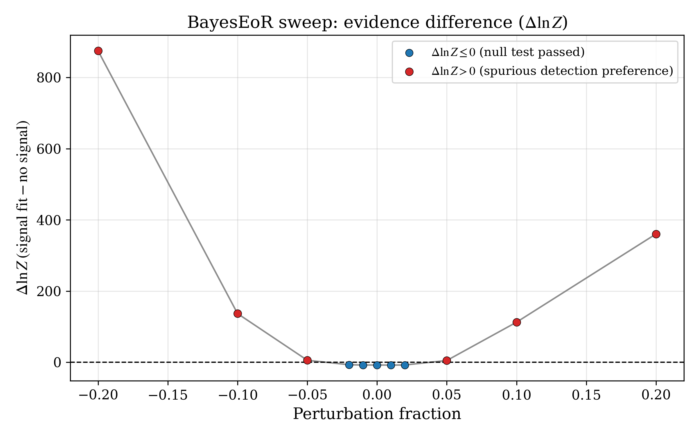
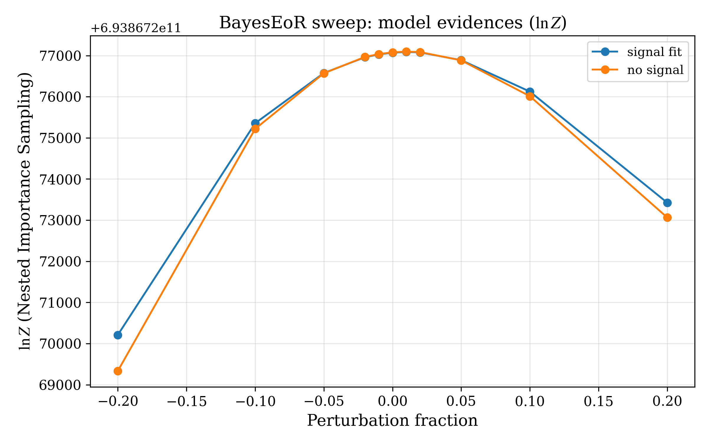
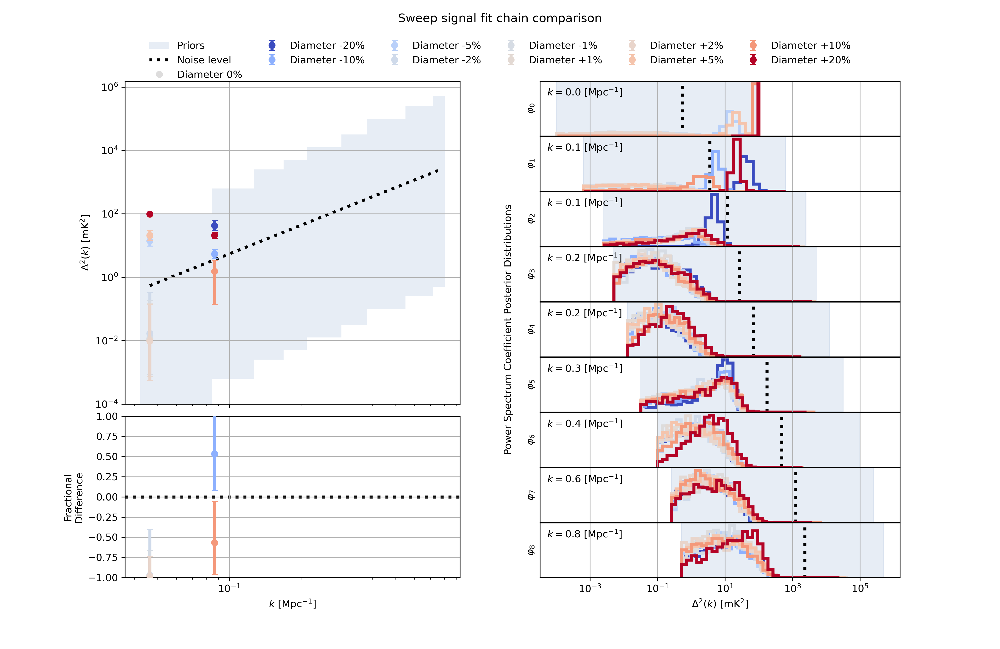

# UKSRC Airy Forward-Model BayesEoR Validation Report: airy_diam14m / GSM_plus_GLEAM / sweep_airy_v3

> **Data provenance warning (2026-07-22):** the input mock-visibility data's own recorded
> `pyuvsim` history cites the telescope config `hex-37-14.6m-gauss-fwhm9.3.yml`, which declares a
> **Gaussian** beam, not an Airy beam, despite the `airy_diam14m` naming used throughout this
> report. This recorded provenance conflicts with the Airy-truth assumption the original
> specification claim depended on; producer-side confirmation of the simulation itself remains
> outstanding. As a result, the previously stated plus-or-minus 2 per cent `antenna_diameter`
> accuracy specification is **not supported** and has been withdrawn. The numerical results below
> are retained as valid computational outputs, described conservatively as the evidence response
> of an Airy forward-model diameter sweep applied to this fixed dataset. See
> [Appendix H](#appendix-h-data-provenance-note) for the full finding.

## Contents

- [Report Metadata](#report-metadata)
- [Executive Summary](#executive-summary)
- [Scope](#scope)
- [Evidence Diagnostics](#evidence-diagnostics)
- [Complete-Analysis Summary](#complete-analysis-summary)
- [Power-Spectrum and Posterior Diagnostics](#power-spectrum-and-posterior-diagnostics)
- [Limitations](#limitations)
- [Conclusions](#conclusions)
- [Appendix A: Inputs](#appendix-a-inputs)
- [Appendix B: Reproducibility Commands](#appendix-b-reproducibility-commands)
- [Appendix C: Campaign Completeness](#appendix-c-campaign-completeness)
- [Appendix D: Assumptions](#appendix-d-assumptions)
- [Appendix E: Artefact Register](#appendix-e-artefact-register)
- [Appendix F: Review Checklist](#appendix-f-review-checklist)
- [Appendix G: Limitations](#appendix-g-limitations)
- [Appendix H: Data Provenance Note](#appendix-h-data-provenance-note)

## Report Metadata

| Field | Value |
| --- | --- |
| Report title | UKSRC Airy forward-model BayesEoR validation report for `airy_diam14m` with `GSM_plus_GLEAM` |
| Campaign identifier | `sweep_airy_v3` (v2 campaign; originally drafted against `sweep_airy_init`, see [Appendix H](#appendix-h-data-provenance-note)) |
| Beam model | `airy_diam14m` — the BayesEoR **forward-model** beam assumption swept over this campaign. The input data's own recorded configuration is listed separately below and is **not** this value; see [Appendix H](#appendix-h-data-provenance-note) |
| Input data recorded beam configuration | `hex-37-14.6m-gauss-fwhm9.3.yml`, which declares `type: 'gaussian'` — cited in the input file's own `pyuvsim` history (see [Appendix A](#appendix-a-inputs) and [Appendix H](#appendix-h-data-provenance-note)) |
| Sky model | `GSM_plus_GLEAM` |
| Validation target | Determine where the BayesEoR null test passes across the tested `antenna_diameter` sweep. **Originally intended** to use that pass window to set a provisional instrument-modelling accuracy specification for the Airy beam; this use is withdrawn, see the provenance warning above and [Appendix H](#appendix-h-data-provenance-note) |
| Report owner | UKSRC Science Enabling - Science Validation Tooling; P. Sims |
| Report date | 2026-04-25 (data refreshed to the v2 campaign 2026-07-15; see [Appendix H](#appendix-h-data-provenance-note)) |
| ValSKA branch or commit | `validation-report-drafts` @ `b529253` (original draft); refreshed against `validation-report-drafts` @ `ff7d999` |
| Report-generation environment versions | Python 3.12.12; `bayeseor` (report/plotting package) 1.1.1.dev126+g00f53dd3a; `valska` 0.1.1.dev310+gec8c89478 — the environment used to run `valska-bayeseor-report`, distinct from the BayesEoR analysis version below |
| BayesEoR analysis version (historical, `sweep_airy_init`) | `2.0.1.dev22+g3f5b6cd2f` (from each run's `output/{signal_fit,no_signal}/.../version.txt`, uniform across all 11 points) |
| BayesEoR analysis version (v2, `sweep_airy_v3`) | `2.0.1.dev31+g96e0d7db5` (uniform across all 11 points; 9 development commits ahead of the historical run — see [Appendix H](#appendix-h-data-provenance-note)) |
| Report status | `draft` |

## Executive Summary

This report assesses the UKSRC Airy beam BayesEoR validation sweep `sweep_airy_v3` (the v2 campaign), which perturbs the BayesEoR forward model's assumed `antenna_diameter` for the `airy_diam14m` beam with the `GSM_plus_GLEAM` sky model. The report was originally drafted against the historical campaign `sweep_airy_init`; see [Appendix H](#appendix-h-data-provenance-note) for that history and for why this file keeps the `sweep_airy_init` filename and asset-directory slug. All 11 sweep points completed successfully according to `sweep_report_summary.json`, and all 11 signal-fit versus no-signal pairings were processed successfully according to `complete_analysis_results.json`.

**The campaign's original purpose — using the null-test pass window to set an Airy antenna-diameter accuracy specification — is not achievable with this data.** The mock visibility dataset used at every point in this sweep (`gsm_plus_gleam-...-airy_quentin.uvh5`) carries its own recorded `pyuvsim` history citing the telescope config `hex-37-14.6m-gauss-fwhm9.3.yml`, and that configuration file, located in this repository, declares `type: 'gaussian'` (both quoted in full in [Appendix H](#appendix-h-data-provenance-note)). `sweep_manifest.json` confirms all 11 `antenna_diameter` points reuse this same `data_path`. This recorded provenance conflicts with the Airy-truth assumption the specification claim depended on; it does not by itself prove the recorded history is accurate, that the located configuration file is byte-identical to whatever was used at simulation time, or that no Airy component entered the file by some other path — but it is sufficient to withdraw the specification claim pending producer confirmation. In any case, the `antenna_diameter` parameter varied across the 11 sweep points remains a property of the BayesEoR Airy *forward model* applied to this fixed, unvarying dataset.

Described conservatively, the retained result is the evidence response of an Airy forward-model `antenna_diameter` sweep applied to this fixed dataset: the null test passes when the assumed diameter is within -2 per cent to +2 per cent of nominal and fails once it departs by 5 per cent or more. Under the interpretation implied by the recorded provenance above — that the dataset's truth beam is Gaussian rather than Airy — this pattern would reflect how well an Airy model of a given diameter statistically mimics a fixed Gaussian beam under this pipeline, rather than the sensitivity of a null test to genuine Airy-diameter error. Either way, it cannot be used to set an Airy antenna-diameter specification: that would require rerunning this sweep against mock data whose Airy truth beam is confirmed by its producer, not merely assumed from naming.

Inputs, reproducibility commands, campaign completeness, and assumptions are recorded in [Appendices A-D](#appendix-a-inputs).

## Scope

The campaign tests how sensitive the BayesEoR null-test outcome is to perturbations in the BayesEoR forward model's assumed `airy_diam14m` antenna diameter, analysing the fixed `GSM_plus_GLEAM` mock visibility data recorded in the sweep manifest. The original scientific objective was to identify the perturbation range over which the null test remains consistent with the no-signal hypothesis and to use that pass range to inform an instrument-modelling accuracy specification for the Airy beam.

**That objective is not achievable with the current data.** As detailed in [Appendix H](#appendix-h-data-provenance-note), the mock visibility data analysed throughout this sweep carries recorded `pyuvsim` provenance citing a Gaussian telescope configuration, not an Airy one, and this has not been confirmed or refuted by the data's producer. Only the BayesEoR forward model's assumed diameter varies across the 11 points; the underlying data does not. This report therefore describes the retained sweep conservatively as the evidence response of an Airy forward-model `antenna_diameter` sweep applied to this fixed dataset, and — only under the interpretation implied by the recorded provenance — as an Airy-forward-model-versus-Gaussian-truth mismatch-tolerance result. Neither framing is used to set an Airy antenna-diameter accuracy specification.

The component under test is the BayesEoR evidence response to the beam-model perturbation parameter `antenna_diameter`. The sweep samples 11 perturbations from -20 per cent to +20 per cent, with finer spacing around the nominal model.

The decision enabled by this report is limited to characterising where this null test passes and fails against the fixed input dataset; it does not, on its own, support defining an Airy antenna-diameter accuracy specification, because the required Airy-truth assumption is unverified and conflicts with the recorded provenance. Doing so would require rerunning an equivalent sweep against mock data with a producer-confirmed Airy truth beam.

## Evidence Diagnostics





*Figures 1 and 2. Top panel: delta log evidence versus perturbation fraction. Bottom panel: signal-fit and no-signal log evidences versus perturbation fraction. These two views present the same underlying Bayesian evidence data. Together they show that the null test passes for all sampled perturbations from -2 per cent to +2 per cent and fails for all sampled perturbations with magnitude 5 per cent or larger. As detailed in [Appendix H](#appendix-h-data-provenance-note), the analysed data's recorded provenance cites a Gaussian, not Airy, telescope configuration, so this pattern is described conservatively as the Airy forward model's evidence response on this fixed dataset (and, under that recorded-provenance interpretation, as Airy-versus-Gaussian mismatch tolerance); it does not support an Airy antenna-diameter specification.*

The trend is not perfectly symmetric: the negative extreme at -20 per cent is more severe than the positive extreme at +20 per cent, but both tails show the same qualitative behaviour. Any further refinement of the 2 per cent to 5 per cent transition is deferred pending resolution of the provenance issue in [Appendix H](#appendix-h-data-provenance-note); it is not a priority until the input data's truth beam type is confirmed by its producer.

## Complete-Analysis Summary

The generated complete-analysis outputs report 11 successful signal-fit versus no-signal comparisons, with 5 PASS classifications and 6 FAIL classifications. Table 1 reproduces the `Delta ln Z` (`ins`-selected `delta_log_evidence`) and PASS/FAIL classification recorded per point in [sweep_report_summary.csv](uksrc_airy_diam14m_gsm_plus_gleam_sweep_airy_init_assets/sweep_report_summary.csv) / [sweep_report_summary.json](uksrc_airy_diam14m_gsm_plus_gleam_sweep_airy_init_assets/sweep_report_summary.json).

A second, independent computation is available in [complete_analysis_successful.csv](uksrc_airy_diam14m_gsm_plus_gleam_sweep_airy_init_assets/complete_analysis_successful.csv) and [complete_analysis_results.json](uksrc_airy_diam14m_gsm_plus_gleam_sweep_airy_init_assets/complete_analysis_results.json), which report a BayesEoR-delegated `log_bayes_factor` per point. This is a different quantity from Table 1's `Delta ln Z` (they are computed by different code paths and do not match numerically point-for-point, typically by a few tenths of a nat), but it yields the same 5 PASS / 6 FAIL classification.

| Perturbation fraction | `Delta ln Z` | Validation |
| --- | ---: | --- |
| -0.20 | 874.95 | FAIL |
| -0.10 | 136.70 | FAIL |
| -0.05 | 5.60 | FAIL |
| -0.02 | -7.00 | PASS |
| -0.01 | -7.76 | PASS |
| 0.00 | -7.81 | PASS |
| +0.01 | -8.01 | PASS |
| +0.02 | -7.66 | PASS |
| +0.05 | 4.92 | FAIL |
| +0.10 | 112.54 | FAIL |
| +0.20 | 360.44 | FAIL |

*Table 1. `Delta ln Z` (`ins`-selected evidence difference) and PASS/FAIL classification per antenna-diameter perturbation, from [sweep_report_summary.csv](uksrc_airy_diam14m_gsm_plus_gleam_sweep_airy_init_assets/sweep_report_summary.csv). The independently computed BayesEoR-delegated log-Bayes-factor, which gives the same classification with different numeric values, is available in [complete_analysis_successful.csv](uksrc_airy_diam14m_gsm_plus_gleam_sweep_airy_init_assets/complete_analysis_successful.csv).*

Taken at face value, these results identify a null-consistent region centred on the nominal assumed beam diameter. However, per [Appendix H](#appendix-h-data-provenance-note), the analysed data's recorded provenance cites a Gaussian telescope configuration rather than an Airy one, so this table is described conservatively as the evidence response of an Airy forward-model diameter sweep against this fixed dataset, not an Airy-versus-Airy diameter accuracy specification. No Airy antenna-diameter specification is supported by this table.

## Power-Spectrum and Posterior Diagnostics



*Figure 3. ValSKA-rendered signal-fit power-spectrum and posterior comparison. This is the primary figure for the report. It supports the interpretation that perturbation-dependent changes are most visible in the lowest-k bins, while the higher-k posterior distributions overlap more substantially across the sweep. The figure is therefore most useful as qualitative support for where the pass and fail regions begin to separate, not as a standalone specification threshold.*

Draft interpretation from visual inspection: the lowest-k power-spectrum points and posterior panels show the clearest separation between the large-perturbation cases and the near-nominal cases. In contrast, several higher-k posterior distributions overlap broadly, which argues for caution when translating this figure into stronger scientific claims.

The current figure is best used as a qualitative diagnostic. It suggests that the perturbation response is concentrated in the lowest-k region, but it does not on its own establish a per-k Bayesian preference. The legacy BayesEoR-delegated figure is retained in the artefact register for comparison but is not reproduced here because it does not add material information beyond Figure 3.

## Limitations

Limitations relevant to the interpretation are summarised in [Appendix G](#appendix-g-limitations).

## Conclusions

- **Conclusion:** All 11 sweep points completed successfully. The null test passes at every tested point from -2 per cent to +2 per cent and fails at every tested point with magnitude 5 per cent or larger. This pattern is well established computationally, but **it does not support an Airy antenna-diameter accuracy specification**: the mock visibility data analysed at every sweep point carries recorded `pyuvsim` provenance citing a Gaussian, not Airy, telescope configuration (see [Appendix H](#appendix-h-data-provenance-note)), and producer confirmation of the simulation is outstanding. The result is described conservatively as the evidence response of an Airy forward-model diameter sweep applied to this fixed dataset — and, only under the interpretation implied by the recorded provenance, as an Airy-versus-Gaussian mismatch-tolerance characterisation. The plus-or-minus-2-per-cent specification stated in earlier drafts of this report is **withdrawn**.
- **Evidence basis:** [sweep_report_summary.csv](uksrc_airy_diam14m_gsm_plus_gleam_sweep_airy_init_assets/sweep_report_summary.csv), [sweep_report_summary.json](uksrc_airy_diam14m_gsm_plus_gleam_sweep_airy_init_assets/sweep_report_summary.json), [complete_analysis_successful.csv](uksrc_airy_diam14m_gsm_plus_gleam_sweep_airy_init_assets/complete_analysis_successful.csv), and [complete_analysis_results.json](uksrc_airy_diam14m_gsm_plus_gleam_sweep_airy_init_assets/complete_analysis_results.json) all support the same 5 PASS / 6 FAIL split, while Figures 1 and 2 show the same behaviour visually. The recorded-provenance finding is grounded directly in the input file's own quoted `pyuvsim` history and the located `hex-37-14.6m-gauss-fwhm9.3.yml` configuration's declared beam type (see [Appendix H](#appendix-h-data-provenance-note)).
- **Residual risk:** No Airy antenna-diameter specification currently exists for this beam/sky combination, and establishing one requires mock data with a producer-confirmed Airy truth beam, which does not yet exist for this campaign. Refining the 2 per cent to 5 per cent mismatch transition is deferred pending resolution of the provenance issue, absent a specific scientific reason to study that mismatch in its own right.
- **Recommended action:** Do not record or use a plus-or-minus-2-per-cent (or any other) Airy antenna-diameter specification from this campaign. Before any such specification can be set, obtain producer confirmation of the input data's truth beam and/or regenerate mock visibility data with a confirmed Airy truth beam for the `airy_diam14m` configuration, then rerun this sweep against it. Retain the current `sweep_airy_v3` results as a valid, separate characterisation of the Airy forward model's response to this fixed dataset.

## Appendix A: Inputs

| Input | Location or identifier | Notes |
| --- | --- | --- |
| Sweep directory | `validation_results/UKSRC/v2/bayeseor/airy_diam14m/GSM_plus_GLEAM/_sweeps/sweep_airy_v3` | Campaign root recorded in `sweep_manifest.json` |
| Report directory | `validation_results/UKSRC/v2/bayeseor/airy_diam14m/GSM_plus_GLEAM/_sweeps/sweep_airy_v3/report` | Contains all generated artefacts used in this report |
| Sweep manifest | `validation_results/UKSRC/v2/bayeseor/airy_diam14m/GSM_plus_GLEAM/_sweeps/sweep_airy_v3/sweep_manifest.json` | Records 11 `antenna_diameter` points and creation time `2026-04-28T19:09:57Z` |
| BayesEoR template YAML | `src/valska_hera_beam/external_tools/bayeseor/templates/validation_airy_diam14m.yaml` | Referenced directly by the sweep manifest (path recorded as-is; see [Appendix H](#appendix-h-data-provenance-note) on the `valska_hera_beam` naming) |
| Data product | `/shared/UKSRC-ST/ps550/BayesEoR/UKSRC_val_mock_vis/initial_data_set_from_Quentin/pyuvsims_airy_10022026/vis/diam14m/gsm_plus_gleam-158.30-167.10-MHz-nf-38-fov-19.4deg-circ-field-1-airy_quentin.uvh5` | Input visibility dataset recorded in the sweep manifest (unchanged from the original campaign). **Despite the `airy` filename, this file's own `pyuvsim` history cites `hex-37-14.6m-gauss-fwhm9.3.yml`, a Gaussian beam config** — see [Appendix H](#appendix-h-data-provenance-note) |
| Perturbation parameter | `antenna_diameter` | Sampled at 11 fractions from -0.20 to +0.20 |

## Appendix B: Reproducibility Commands

The report-generation command used for the v2 refresh is:

```bash
python -m valska.external_tools.bayeseor.cli_report \
  validation_results/UKSRC/v2/bayeseor/airy_diam14m/GSM_plus_GLEAM/_sweeps/sweep_airy_v3 \
  --include-plot-analysis-results \
  --include-complete-analysis-table \
  --export-report-assets docs/source/reports/uksrc_airy_diam14m_gsm_plus_gleam_sweep_airy_init_assets \
  --print-complete-analysis-table
```

If the ValSKA environment is already loaded, the equivalent CLI command is:

```bash
valska-bayeseor-report \
  validation_results/UKSRC/v2/bayeseor/airy_diam14m/GSM_plus_GLEAM/_sweeps/sweep_airy_v3 \
  --include-plot-analysis-results \
  --include-complete-analysis-table \
  --export-report-assets docs/source/reports/uksrc_airy_diam14m_gsm_plus_gleam_sweep_airy_init_assets \
  --print-complete-analysis-table
```

This command was run against the v2 sweep on 2026-07-15, exited successfully, and its `--export-report-assets` output (including `artefact_manifest.json`) is what populates this report's asset directory. The original draft's commands (against `sweep_airy_init`) are preserved in [Appendix H](#appendix-h-data-provenance-note) for the historical record.

## Appendix C: Campaign Completeness

All 11 sweep points are reported as `ok` in `sweep_report_summary.csv`, and `complete_analysis_results.json` reports 11 successful pointwise comparisons with zero errors. Report-local copies of these generated artefacts are stored under `uksrc_airy_diam14m_gsm_plus_gleam_sweep_airy_init_assets/` so the documentation build can embed the associated figures directly.

| Quantity | Value |
| --- | --- |
| Total sweep points | 11 |
| Complete sweep points | 11 |
| Incomplete sweep points | 0 |
| Evidence source used for sweep interpretation | `ins` for all 11 points |
| PASS points | 5 |
| FAIL points | 6 |
| Error points | 0 |
| Notes | The sweep is complete, so the interpretation is not being driven by missing points; however, the sign change at plus or minus 5 per cent warrants follow-up |

Report-local copies of the completeness summaries are available at [sweep_report_summary.csv](uksrc_airy_diam14m_gsm_plus_gleam_sweep_airy_init_assets/sweep_report_summary.csv) and [sweep_report_summary.json](uksrc_airy_diam14m_gsm_plus_gleam_sweep_airy_init_assets/sweep_report_summary.json). The source generated files remain in the sweep report directory listed in Appendix A.

## Appendix D: Assumptions

| Assumption | Why it matters | Status |
| --- | --- | --- |
| The input mock visibility data has an Airy truth beam matching `airy_diam14m` | Required for this sweep to characterise Airy antenna-diameter accuracy rather than Airy-versus-Gaussian model mismatch | **`not supported`** — recorded provenance conflicts with this assumption: the data's own `pyuvsim` history cites the telescope config `hex-37-14.6m-gauss-fwhm9.3.yml`, which declares a Gaussian beam; producer confirmation is outstanding. See [Appendix H](#appendix-h-data-provenance-note) |
| Signal-fit and no-signal chains are paired correctly for each perturbation label | The PASS and FAIL summary is only meaningful if each comparison matches like with like | `tested` via 11 successful pairings in `complete_analysis_results.json` |
| The `ins` evidence source is the intended source for sweep-level interpretation | The reported `Delta ln Z` values come from the selected evidence source in the summary outputs | `tested` via `selected_source = ins` for all 11 points in `sweep_report_summary.json` |
| Incomplete runs do not bias the interpretation | Missing points could distort the apparent safe region | `tested` because no incomplete points are reported |
| The expected noise-power reference drawn in the analysis figures is appropriate for this campaign | The visual significance of posterior and spectrum offsets depends on that reference | `open` in this draft |
| Current posterior summaries use log-uniform-prior chains | This constrains how non-detections may be described | `accepted` |
| Classified non-detections are not calibrated upper limits unless uniform-prior chains are run | Prevents overstating the result as a 95 per cent upper-limit statement | `accepted` |
| Using the largest tested pass point to guide a provisional Airy antenna-diameter specification is acceptable for this draft | The report uses the pass window to inform a modelling-accuracy bound rather than to infer an exact threshold | **`not supported`** — blocked by the recorded-provenance conflict above; no Airy antenna-diameter specification can be set from this campaign until it is rerun against data with a producer-confirmed Airy truth beam |

## Appendix E: Artefact Register

| Artefact | Role in report | Path |
| --- | --- | --- |
| Sweep summary CSV | Campaign completeness and per-point evidence metrics; report-local copy for documentation rendering | [sweep_report_summary.csv](uksrc_airy_diam14m_gsm_plus_gleam_sweep_airy_init_assets/sweep_report_summary.csv) |
| Sweep summary JSON | Machine-readable sweep payload used for counts and `Delta ln Z` values; report-local copy | [sweep_report_summary.json](uksrc_airy_diam14m_gsm_plus_gleam_sweep_airy_init_assets/sweep_report_summary.json) |
| Complete-analysis CSV | Generated pass or fail table for successful signal-fit versus no-signal pairings; report-local copy | [complete_analysis_successful.csv](uksrc_airy_diam14m_gsm_plus_gleam_sweep_airy_init_assets/complete_analysis_successful.csv) |
| Complete-analysis JSON | Machine-readable complete-analysis payload used for PASS, FAIL, and error totals; report-local copy | [complete_analysis_results.json](uksrc_airy_diam14m_gsm_plus_gleam_sweep_airy_init_assets/complete_analysis_results.json) |
| Delta log evidence plot | Primary evidence-difference diagnostic; report-local copy used for embedding | [delta_log_evidence_vs_perturb_frac.png](uksrc_airy_diam14m_gsm_plus_gleam_sweep_airy_init_assets/delta_log_evidence_vs_perturb_frac.png) |
| Evidence-by-model plot | Supporting evidence diagnostic for hypothesis separation across the sweep; report-local copy used for embedding | [log_evidence_by_model_vs_perturb_frac.png](uksrc_airy_diam14m_gsm_plus_gleam_sweep_airy_init_assets/log_evidence_by_model_vs_perturb_frac.png) |
| ValSKA analysis figure | Primary power-spectrum and posterior diagnostic; report-local copy used for embedding | [plot_analysis_results_signal_fit_valska.png](uksrc_airy_diam14m_gsm_plus_gleam_sweep_airy_init_assets/plot_analysis_results_signal_fit_valska.png) |
| Legacy analysis figure | Comparison-only rendering retained for audit trail but not reproduced in the main text | [plot_analysis_results_signal_fit.png](uksrc_airy_diam14m_gsm_plus_gleam_sweep_airy_init_assets/plot_analysis_results_signal_fit.png) |
| Artefact export manifest | Provenance record written by `--export-report-assets`, recording the source sweep/report directories and export timestamp for the assets above | [artefact_manifest.json](uksrc_airy_diam14m_gsm_plus_gleam_sweep_airy_init_assets/artefact_manifest.json) |

## Appendix F: Review Checklist

- [x] The report states a clear validation question.
- [x] All figures and tables are generated artefacts or clearly marked manual summaries.
- [x] Figure captions state what conclusion the artefact supports.
- [x] The report distinguishes detections, non-detections, and calibrated upper limits.
- [x] The evidence source (`ins`) is recorded.
- [x] The ValSKA branch and commit are recorded.
- [x] Known limitations are not hidden in prose.
- [x] An equivalent `valska-bayeseor-report` reproducibility command completed successfully in this workspace.
- [x] The report-generation environment version and the BayesEoR analysis version (which produced the chains) are recorded separately, and their difference between campaigns is noted rather than assumed benign.
- [x] The input data's recorded beam provenance was checked against its filename/label claim, by reading the file's own `pyuvsim` history and the declared beam type in the config it cites, rather than assumed from naming; see [Appendix H](#appendix-h-data-provenance-note).

## Appendix G: Limitations

| Limitation | Consequence | Follow-up |
| --- | --- | --- |
| The input mock visibility data's recorded provenance cites a Gaussian, not Airy, telescope configuration; producer confirmation is outstanding | No Airy antenna-diameter accuracy specification can be derived from this campaign; the PASS/FAIL pattern is described conservatively as the Airy forward model's evidence response on this fixed dataset | Obtain producer confirmation of the input data's truth beam, and/or regenerate mock visibility data with a confirmed Airy truth beam for `airy_diam14m`, before attempting any Airy antenna-diameter specification |
| No per-k Bayesian evidence comparison | Detection and non-detection classification remains a proxy rather than a mode-by-mode evidence test | Add a future per-k Bayesian comparison if campaign sign-off requires mode-resolved claims |
| Log-uniform-prior chains used for current posteriors | Classified non-detections are not calibrated 95 per cent upper limits | Run uniform-prior upper-limit chains for any bins that need publishable upper-limit statements |
| The transition between the largest tested pass point and the first tested fail point is not sampled | The sweep bounds where this fixed-dataset null test transitions between pass and fail, but does not identify the exact threshold; per the row above, this bound does not support any Airy antenna-diameter specification regardless | Deferred pending resolution of the provenance issue above; refine only if a producer-confirmed Airy-truth dataset becomes available and there remains a specific scientific reason to characterise this transition |

## Appendix H: Data Provenance Note

This report was originally drafted on 2026-04-25 against the historical campaign `sweep_airy_init` (created `2026-02-27T23:36:40Z`, under `validation_results/UKSRC/bayeseor/...`). On 2026-07-15, as part of a merge and refresh of the `validation-report-drafts` branch, the report's title, executive summary, data, figures, and tables were updated to the v2 campaign `sweep_airy_v3` (created `2026-04-28T19:09:57Z`, under `validation_results/UKSRC/v2/bayeseor/...`), which uses the same beam model, sky model, input visibility dataset, and `antenna_diameter` sweep points as the original.

The report's filename (`uksrc_airy_diam14m_gsm_plus_gleam_sweep_airy_init.md`) and asset-directory slug (`uksrc_airy_diam14m_gsm_plus_gleam_sweep_airy_init_assets/`) intentionally still say `sweep_airy_init`. These are referenced from `docs/source/reports.rst` (the toctree entry) and `docs/source/workflows/bayeseor_reporting.md` (an example asset path), plus the report's own embedded image/asset links; renaming them now would break those references for no content benefit, since the filename is only a slug and the report's title, H1, and body text are the parts that state which campaign the content actually describes. A future rename to a `sweep_airy_v3`-based slug, with the corresponding link updates, is a reasonable follow-up but was treated as out of scope for this focused content refresh.

Before updating this report, the following checks were performed to confirm the v2 campaign reproduces rather than changes the original result:

- **Structural completeness:** All 11 v2 sweep points report `status: ok` with zero errors, and `complete_analysis_results.json` reports 11/11 successful signal-fit-versus-no-signal pairings — matching the original campaign's completeness.
- **Point-by-point evidence comparison:** `delta_log_evidence` (`ins` source) was compared point-by-point between `sweep_airy_init` and `sweep_airy_v3`. Every point agrees to within approximately 0.05-1.0 nats (against magnitudes ranging from about 5 to 875 nats). The PASS/FAIL classification (5 PASS at 0, ±1%, ±2%; 6 FAIL at ±5%, ±10%, ±20%) is identical between the two campaigns. Note that the two campaigns were run with different BayesEoR analysis versions (`2.0.1.dev22+g3f5b6cd2f` for `sweep_airy_init` versus `2.0.1.dev31+g96e0d7db5` for `sweep_airy_v3` — see the Report Metadata table), and the generated signal-fit and no-signal configuration YAMLs are otherwise identical between the two campaigns at all 11 points (differing only in `output_dir`). This refresh does not attempt to attribute the small numerical differences to nested-sampling stochasticity versus the BayesEoR revision change specifically; either or both may contribute. What is established is that the PASS/FAIL classification is robust across both BayesEoR versions tested.
- **Visual comparison:** The delta-log-evidence plot, the evidence-by-model plot, and the ValSKA-rendered signal-fit/posterior figure were compared between the two campaigns. All three show the same qualitative pattern (same PASS/FAIL point colouring, same posterior shapes per `k` bin, same asymmetry between the -20% and +20% tails).

On this basis, the report's data, figures, and tables were refreshed to the v2 outputs using `valska-bayeseor-report ... --export-report-assets` (see [Appendix B](#appendix-b-reproducibility-commands)), and the resulting `artefact_manifest.json` is retained in [Appendix E](#appendix-e-artefact-register) as the record of that export. The report's scientific conclusions (Executive Summary, Conclusions) were **not** re-derived independently for this refresh; they are unchanged because the v2 numbers reproduce the same PASS/FAIL pattern and the same qualitative evidence trend as the original draft. This refresh does not constitute a scientific sign-off on the v2 campaign or on the plus-or-minus 2 per cent specification recommendation — that remains an open item, as recorded in Appendix D and Appendix F.

The historical campaign's own reproducibility commands, for reference, were:

```bash
valska-bayeseor-report \
  validation_results/UKSRC/bayeseor/airy_diam14m/GSM_plus_GLEAM/_sweeps/sweep_airy_init \
  --include-plot-analysis-results \
  --print-complete-analysis-table
```

### Update 2026-07-22: recorded beam-provenance conflict

This section records what is directly established about the input data's beam-type provenance,
and distinguishes it clearly from what remains unverified.

**Directly established:**

1. The input file's own `pyuvsim` history (read directly from the UVH5 file's `Header/history`
   field) records:

   ```
   Simulated with pyuvsim version: 1.4.1.dev96+g6b946d3.dirty. Sources from source list(s):
   [gleam-158.30-167.10-MHz-nf-38-pld-mean-2.82-std-0.19-fov-19.4deg-circ-field-1.skyh5].
   Based on config files: fov-19.4-oscar-sm.yml, telescope_config/hex-37-14.6m-gauss-fwhm9.3.yml,
   telescope_config/hex-37-14.6m.csv Npus = 8. ...
   ```

2. The telescope config file named in that history, `hex-37-14.6m-gauss-fwhm9.3.yml`, is present
   in this repository at
   `src/valska/external_tools/pyuvsim/templates/telescope_config/hex-37-14.6m-gauss-fwhm9.3.yml`
   and declares:

   ```yaml
   beam_paths:
     0:
       type: 'gaussian'
       sigma: 0.09754450727124656 # FWHM baseline beam ~ 9.3 deg
   ```

3. `sweep_manifest.json` for `sweep_airy_v3` records `data_path` pointing at this same input
   file for all 11 `antenna_diameter` points; the input dataset does not vary across the sweep.

**What this does and does not establish:** together, these three facts show that the input
file's own recorded provenance names a Gaussian, not Airy, beam configuration, despite the
file's `airy` naming — directly conflicting with the Airy-truth assumption the original
specification claim depended on. This is sufficient to withdraw that claim. It does **not**
independently establish that the recorded history is itself accurate, that the located
configuration file is byte-identical to whatever configuration was in effect at simulation
time, or that no Airy-beam component was combined into this file by some other path not
reflected in the history. Producer-side confirmation of the simulation remains outstanding.

Because this report's own "structural completeness" and "point-by-point evidence comparison"
checks (above) already established that `sweep_airy_v3` reuses the same input data product as
the original `sweep_airy_init` campaign, the conflict above applies to that historical campaign
too — it is not a `sweep_airy_v3`-specific regression, and it was not caught by the earlier v2
refresh because that refresh (see above) deliberately checked reproduction of the historical
numeric result rather than re-deriving the underlying beam-provenance assumption from first
principles.

**Impact:** the `antenna_diameter` parameter sampled across all 11 points of this sweep is, in
any case, a property of the BayesEoR Airy forward model only; the input file itself does not
vary across the sweep. The PASS/FAIL pattern in [Table 1](#complete-analysis-summary) remains
valid as a computed result but is now described conservatively as the evidence response of an
Airy forward-model diameter sweep applied to this fixed dataset — and, only under the
interpretation implied by the recorded provenance above, as an Airy-versus-Gaussian
mismatch-tolerance result. This report has been updated throughout to reflect that reframing,
and the previously stated plus-or-minus-2-per-cent specification is withdrawn pending producer
confirmation of the input data's truth beam. See the provenance warning at the top of this
report, the Executive Summary, Scope, Appendix D, and Appendix G for the corresponding updates.
